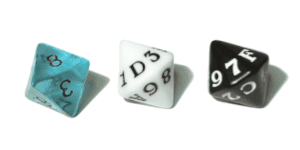

# Hex Dice 🎲 Bip39 Mnemonic Generator

Generate a 12-24 words [BIP39 mnemonic](https://github.com/bitcoin/bips/blob/master/bip-0039.mediawiki) using hex dice, inspired: [bitup.space/8ff](http://bitup.space/8ff/) | [iancoleman.io/bip39](https://iancoleman.io/bip39/)  
Author [st3b1t](https://x.com/st3b1t) | [Github Sources](https://github.com/st3b1t/bip39-hex-dice) | [Donate](https://github.com/st3b1t#donate)

## !Download and use offline!

https://st3b1t.github.io/bip39-hex-dice/index.html

## Requirements

Get one 8-sided die and two 16-sided dice, as shown in the image below.

